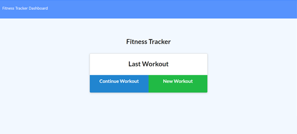
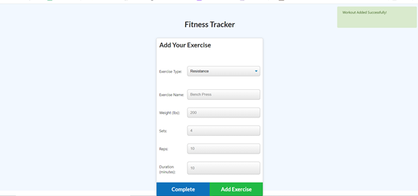
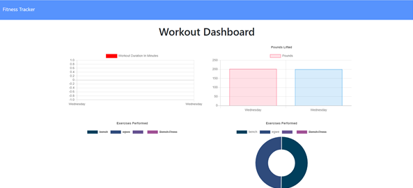

# Workout-Tracker

A simple web app for tracking your workouts. You can pick up where you left off or log a new workout.
When visiting the dashboard, you are presented with four charts to track various statistics, these are:

* (i) a graph that tracks how much time (mins) you spent working out per day;
* (ii) a graph that tracks how much weight (lbs) you lifted per day.
* (iii) a pie chart that shows the exercises you have completed by time (i.e. so you can see which exercise you have spent the most/least time doing).
* (iv) a pie chart that shows the exercises completed by weight (i.e. so you can see which the exercise you have lifted the most/least doing).

## Link To Deployed Heroku Application
Heroku App ---> [here](https://workout-trakker.herokuapp.com/)

## Technologies

* Node.js
* MongoDB
* Mongoose
* Express

## Installation
The file contains a package.json so to run this on your local device you will just need to:
* (i) clone the repository
* (ii) start a mongodb server in the background by opening up the terminal and running `mongodb`
* (iii) navigate to the root directory in your terminal and run `npm i` 
* (iv) run `npm start` in the terminal from the root directory

## Usage
You may do either of the following:
* Follow the installation instructions above to run the app on your local device.
* Use the deployed Heroku app, found at the top of this README

## Screenshots
Application in action --->

- Initial Page

- Add an exercise

- Data visualisation page

## License

> This project was created under the standard MIT licence.

> [Learn more about this licence.](https://lbesson.mit-license.org/)

## Questions?

Please contact me through my GitHub provided below if you have any questions relating to how the application works or any of my other projects

My GitHub username is Robbie-Bridgwater

Link to my GitHub Profile ---> https://github.com/Robbie-Bridgwater
